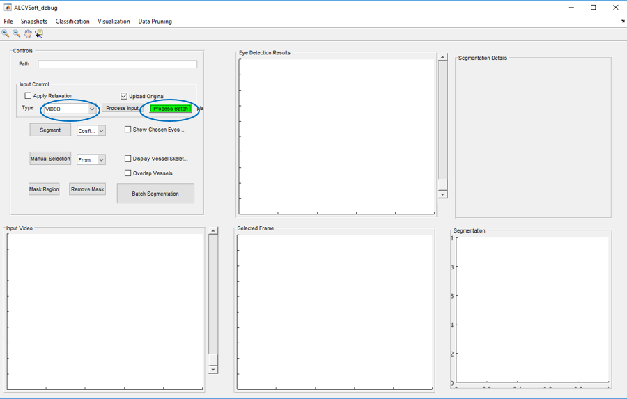
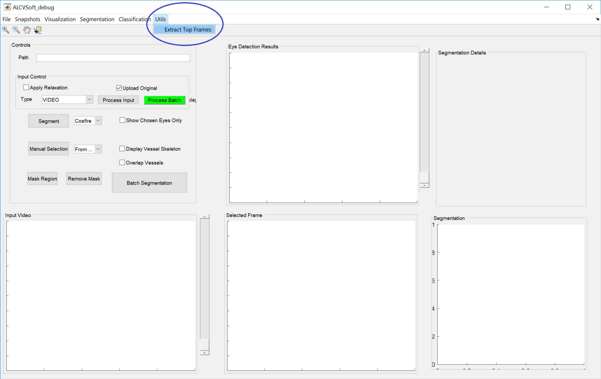
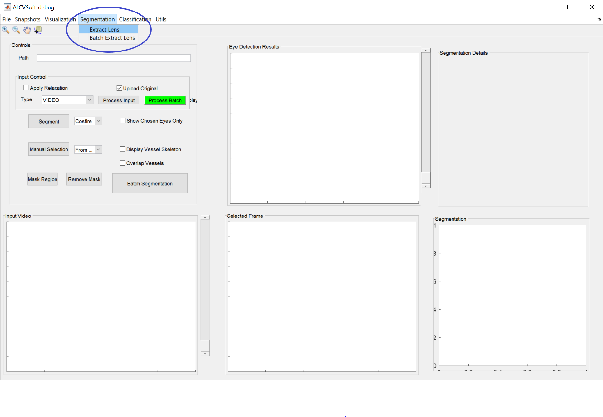
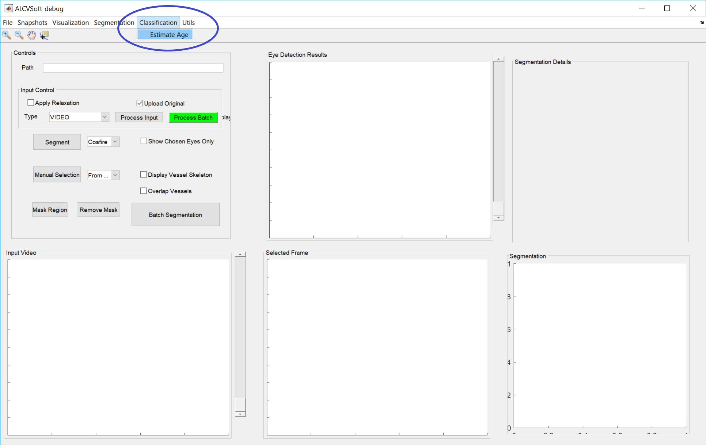

# ALCV Lens Segmentation

This repository hosts the code used for both the coarse anterior lens localization (CALL) and finer anterior lens localization (FALL) methods detailed in [Arjun D. Desai, Chunlei Peng, Leyuan Fang, Dibyendu Mukherjee, Andrew Yeung, Stephanie J. Jaffe, Jennifer B. Griffin, and Sina Farsiu,
"Open-source, machine and deep learning-based automated software for age estimation through smartphone lens imaging",
 Biomedical Optics Express, (IN PRESS), 2018](https://www.google.com)

Please cite this paper if you use any component of this software.

This software is copyrighted and may only be used for academic research.
COPYRIGHT (C) 2018 DUKE UNIVERSITY

Released under GPL v2 License

## Dependencies
### Python
 - python            >=        3.5.5
 - h5py            >=          2.8.0                     
 - imageio           >=        2.3.0                   
 - Keras               >=      2.1.5              
 - matplotlib            >=    2.2.2                  
 - numpy                   >=  1.14.5                
 - opencv-python            >= 3.4.1.15              
 - Pillow                   >= 5.2.0                                        
 - pydot                  >=   1.2.4                             
 - scikit-learn              0.19.2                   
 - scipy                     >=1.1.0                  
 - tesnorflow/tensorflow-gpu          >=  1.4.0      


### MATLAB
- MATLAB >= R2018a
- [LIBSVM for MATLAB](https://www.csie.ntu.edu.tw/~cjlin/libsvm/) >= 3.18
- [matconvnet](http://www.vlfeat.org/matconvnet/) >= 1.0-beta25

### Open source libraries
We thank all research pioneers who have open-sourced their work for public use. We have utilized several open-source libraries as part of our code, all of which are documented below.

#### Blind image quality analyzers
1. S. Gabarda and G. Cristóbal, "Blind image quality assessment through anisotropy," J.
Opt. Soc. Am. A 24, B42-B51 (2007). [link](https://www.osapublishing.org/josaa/abstract.cfm?uri=josaa-24-12-b42)
2. A. Mittal, R. Soundararajan, and A. C. Bovik, "Making a "Completely Blind" Image
Quality Analyzer," IEEE Signal Processing Letters 20, 209-212 (2013). [link](https://ieeexplore.ieee.org/document/6353522)

#### Circular hough transform
3. D. Young, "Hough Transform for Circles", Mathworks File Exchange (2016). [link](https://www.mathworks.com/matlabcentral/fileexchange/26978-hough-transform-for-circles)

#### Extraneous
The following code was added as part of the library but not used in the final computation:

4. Dense scene correspondence - C. Liu, J. Yuen, and A. Torralba. "Sift flow: Dense correspondence across scenes and its applications." IEEE transactions on pattern analysis and machine intelligence 33.5, 978-994 (2011). [link](https://people.csail.mit.edu/celiu/SIFTflow/)

5. Image fusion framework - Y. Liu, S. Liu and Z. Wang, "A General Framework for Image Fusion Based on Multi-scale Transform and Sparse Representation", Information Fusion (2014). [link](https://github.com/RexYing/infant-eye/tree/master/Dibyendu/Project%20-%20Neonatal%20Eye/External%20Codes/Fusion/MST_SR_fusion_toolbox)

6. Intelligent Scissors [link](http://www.andrewnoske.com/wiki/Livewire_Segmentation)

7. Cosfire segmentation - G. Azzopardi, N. Strisciuglio, M. Vento, and N. Petkov, "Trainable COSFIRE filters for vessel delineation with application to retinal images", Medical Image Analysis, Available online 3 September 2014, ISSN 1361-8415 [link](http://dx.doi.org/10.1016/j.media.2014.08.002) (available feature in MATLAB GUI code, but not used in lens segmentation)

8. Dijkstra segmentation - L. Grady, Graph Analysis Toolbox. [link](http://leogrady.net/software/) (available feature in MATLAB GUI code, but not used in lens segmentation)

9. Hysteresis segmentation - L. Xie, "Hysteresis thresholding for 3D images (or 2D)" Mathworks File Exchange (2013). [link](https://www.mathworks.com/matlabcentral/fileexchange/44648-hysteresis-thresholding-for-3d-images-or-2d)

## Environment Setup
### MATLAB

1. Turn off hardware acceleration for video decoding
`matlab.video.read.UseHardwareAcceleration('off')`

2. Download and setup [matconvnet](http://www.vlfeat.org/matconvnet/)

3. Download [resnet-152-dag](http://www.vlfeat.org/matconvnet/models/imagenet-resnet-152-dag.mat) and save in `mtlb/classification_utils` folder

4. Download [libsvm](https://www.csie.ntu.edu.tw/~cjlin/libsvm/) for MATLAB. Add to matlab path.

## Input files

All input files must be videos with the ```.mov``` extension. While the filenames do not have a fixed format, the recommended format is ```<CASEID>_<DATE>_<TIME>.mov``` without the carats (```<```,`>`). The ```CASEID``` is an 8 digit string such as ```01020031```. It is preferred if the format of the ```DATE``` string is maintained across videos. The standard form is ```YYYYDDMM```. ```TIME``` is recorded in military time (e.g. `9:20 p.m.` is `2120`).

Examples:
 - `01010001_20180401_0920`: Subject 01010001, born April 01, 2018 at 9:20 AM
 - `01010002_Apr012018_1743`: Subject 01010002, born April 01, 2018 at 5:43 PM


**Please put all videos in a single folder**. This folder will be the base folder for analysis.  

## Lens segmentation
This section describes the pipeline used for both the coarse anterior lens localization (CALL) and finer anterior lens localization (FALL) methods detailed in [Desai and Peng, et. al - TODO](google.com)

### Coarse anterior lens localization (CALL)

To use CALL, save videos with the ```.mov``` extension in a folder. Run the ```ALCV-debug.m``` method.

##### Generate mat files
Select ```Video``` in the dropdown and click the ```Process Batch``` button. For more information, see the figure below. The dropdown and the button are circled.



A popup selection window will appear. Select the folder containing the videos you would like to analyze. Confirm the selection and wait for the process to complete. Please note that this process does take some time. A waitbar will display the index of the video it is currently processing. If the process fails on a video, it will notify the user on the MATLAB console. The video folder should now contain a ```.mat``` file for every ```.mov``` video file.

##### Extract top frames
Next use the ALCV window to extract all top frames from the mat file. Select ```Utils --> Extract Top Frames``` in the menu bar. The menu option is circled in the figure below. Choose the folder where all the mat files were stored. By default, these mat files will be in the same folder as the videos. The frames will be extracted and saved as png files in the subfolder ```ALCV_frames_top50/```. This folder will have additional directories labelled by case id. Each case id directory will contain the top frames selected by the CALL algorithm.

 **Do not change the path to or file format of these images.**



### Finer anterior lens localization (FALL)
The finer anterior lens localization algorithm was trained using 25-fold [cross validation](https://www.openml.org/a/estimation-procedures/1). This means that 25 different optimal architectures (25 different weight files) were produced, one for each fold. As there are multiple models to choose from, you can choose which weights to load into the model.

There are a few ways to go about this issue. One approach is to use a single model initialized with a weight file of your choosing. Ideally, this would be the weight file that has the lowest validation loss, as that is our metric for performance. However, you can choose whichever file you wish.

Another approach is to use [ensemble learning](https://papers.nips.cc/paper/1001-neural-network-ensembles-cross-validation-and-active-learning.pdf), where each of the 25 models can be used to produce a binary prediction mask, resulting in 25 different masks. Then to determine the final mask, each of the 25 models (ensembles) votes whether the pixel is 1 or 0. So for any pixel *(i, j)*, there are 25 votes. A simple method would take the average of the probabilities across different models and return the class with the highest averaged probability. This is the ensemble method we have implemented. As ensemble learning utilizes multiple models, the inference time will be slower.

Note that neither of these methods have been tested independently on a test set because the evaluation on our test set was done following the k-fold cross validation protocol.

We have provided the code for you to run both of these methods. Details on how to use this is described below

#### Network Weights
The 25-fold cross validation scheme produced 25 different optimal weight files. These files can be found [here - Link weight](google.com). The optimal weights for each cross validation experiment are the weights that minimized the validation loss.

All weight files are of the H5 file format. The file names indicate the validation loss. For example, a weight file named `weights.019-0.1529.h5` produced a validation loss of 0.1529 after epoch 19/20.

#### Shell Interface
To run this program from a python-enabled shell or command line interface, run `python -m opt/path/pipeline` with the flags detailed below. `opt/path` is the path to the file `fall_pipeline.py`

Note this program is meant to be run from the command line. As a result, all import statements are local imports.

#### Setup
To run this program, open a shell/terminal window that is enabled with the python dependencies listed in the Dependencies section. A [python virtual environment](https://realpython.com/python-virtual-environments-a-primer/) is recommended.

#### Shell Help
The command line flags are explained below:

**Required**:
- `-d D, --dir D`: The path to the directory that you want to process. Safer to use absolute paths.
  1. If you are processing a single subject, `D` should be the path to that subject folder. For example, `<path_to_folder>/ALCV_frames_top50/01010001_20180401_0920`.
  2. If you are processing a batch of subjects (`-b, --batch` flag), then specify the path to the directory holding the multiple subjects (i.e. `ALCV_frames_top50`). For example, `<path_to_folder>/ALCV_frames_top50`


 - `-w W, --weight W`: The path to weight(s) to use for the network.
  1. If using a single weight file, specify the path to the weight file. For example, `<path_to_weights_directory>/weights/weights.019-0.1529.h5`
  2. If using multiple weight files (ensemble), specify the path to the weight directory. All H5 weight files in this directory will be used for ensembling. For example, `<path_to_weights_directory>/weights`

**Optional**:
- `-r`: Resize frames to size of images used to train the network. The network is fully convolutional, so it can take input images of any size greater than 216x384. However, the performance was not tested on images of different sizes.

- `-b, --batch`: Process multiple subjects. See details on `-d` flag for more information.

- `--mini_batch_size`: Mini batch size for inference on the network. Default is 50.


The output of the command line help menu (```python -m pipeline -h```) can be seen below:
```
usage: pipeline.py [-h] -d D -w W [-r] [-b] [--mini_batch_size BS]

Segment anterior lens regions in frames

optional arguments:
  -h, --help            show this help message and exit
  -d D, --dir D         Either 1. Path to subject directory storing frames. or
                        2. Path to directory of subject directories
  -w W, --weight W      path to weight(s). If path is a directory, use
                        ensemble learning. Else path must be an h5 file
  -r                    Resize images to default shape for segmentation. If
                        input images are not of shape (216, 384, 3), then
                        model may not perform optimally
  -b, --batch           Batch process all subdirectories in D. Assumes all
                        subdirectories in D are of subjects
  --mini_batch_size BS  Mini batch size. Default is 50
```

#### Use cases
All use cases assume that the current working directory is this repository. If the working directory is different, make sure to specify the path to `Fall-segmentation/pipeline.py` when running the script. For example, `python -m ~/alcv-pipeline/Fall-segmentation/pipeline` if the repository is located in the user directory.

All cases also resize the input using `-r` flag, because this is recommended. if you don't want to, remove the `-r` flag from the use cases


##### Case 1
###### Process single subject in `ALCV_frames_top50` folder
`python -m Fall-segmentation/pipeline -r -d <path>/ALCV_frames_top50/<subject_folder> -w <path>/weights/weights.019-0.1529.h5`

##### Case 2
###### Process multiple subjects in `ALCV_frames_top50` folder
`python -m Fall-segmentation/pipeline -b -r -d <path>/ALCV_frames_top50 -w <path>/weights/weights.019-0.1529.h5`

##### Case 3
###### Process multiple subjects using ensemble inference
`python -m Fall-segmentation/pipeline -b -r -d <path>/ALCV_frames_top50 -w <path>/weights`

##### Case 4
###### Process multiple subjects with mini-batch-size of 16
`python -m Fall-segmentation/pipeline -b -r -d <path>/ALCV_frames_top50 -w <path>/weights/weights.019-0.1529.h5 --mini_batch_size 16`

#### Output
Following the finer anterior lens localization, each subject folder should contain two folders `mask-pred` and `mask-pred-visual`. The `mask-pred` folder contains the mask as 0s and 1s, but it is hard to visualize. So we create another folder `mask-pred-visual` where the masks can be seen as images. Note these are the mask outputs of the FALL segmentation, they have not been refined yet.

### Extracting the lens
Return to the MATLAB GUI. Click on the `Segmentation` menu in the menu bar. This menu is circled in the figure below. There are two options to extract the lens- either subject by subject or by batch. The two menu options `Extract lens` and `Batch Extract lens` correspond to these options respectively.



**`Extract Lens`**:
If you chose to extract lens by subject, you will be prompted the select the directory of the subject you wish to process.

**`Batch Extract Lens`**:
If you choose to batch extract lens for multiple subjects, you will be prompted to select the parent directory of the subject folders (i.e. `ALCV_frames_top50`).

#### Output
The extracted lens regions and the best lens region will be stored in the folder `lens` and `best_lens` for each subject

### Classification
In the paper, the classification was tested using leave-1-out cross validation, which for 124 subjects, yielded 124 SVM models for each of the 6 thresholds (33-38 weeks). As this pipeline is only for inference purposes, we have retrained a single model for each threshold using the 124 subjects in the paper.

In the MATLAB GUI, go to the `Classification -> Estimate Age` option as circled in the figure below. Select the `ALCV_frames_top50` directory to process classify the ages of all of the subjects with extracted lens regions in that folder. The results will be saved to a `results.csv` file.


